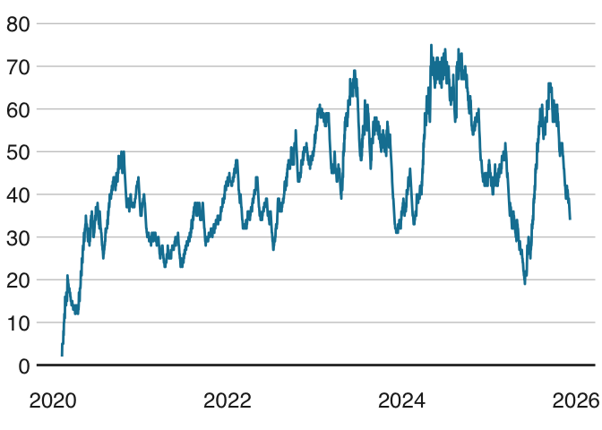
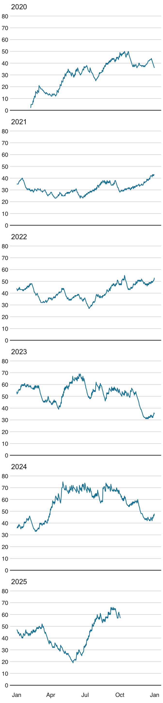
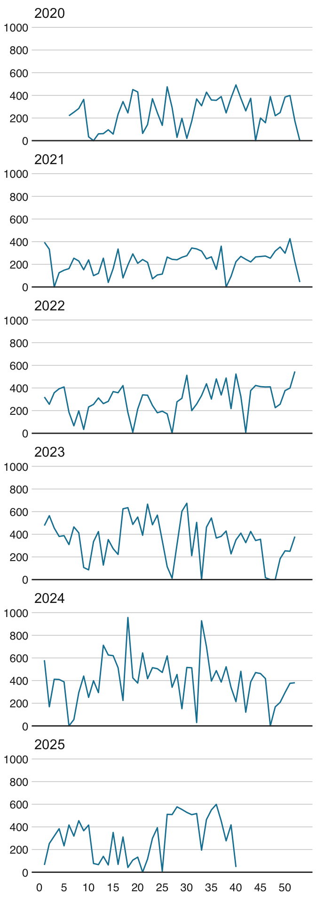

Trainingsstatisik
================
Dominik Rappaport

- [Trainingsstatistiken](#trainingsstatistiken)
- [Verlauf der chronischen
  Trainingslast](#verlauf-der-chronischen-trainingslast)
  - [Verlauf gesamt](#verlauf-gesamt)
  - [Verlauf nach Jahren](#verlauf-nach-jahren)
- [Krankenstandstage](#krankenstandstage)
- [TSS pro Kalenderwoche](#tss-pro-kalenderwoche)
  - [Verlauf nach Jahren](#verlauf-nach-jahren-1)

## Trainingsstatistiken

Übersicht über Trainingsstunden, TSS und CTL für die Jahre 2020 bis
2025. Als Zeitraum zum Berechnen des Durchschnitts wurden alle (bereits
verstrichenen) Wochen des jeweiligen Jahres herangezogen und nicht nur
jene, an denen ein Training grundsätzlich möglich war. Als Konsequenz
drücken zum Beispiel Urlaube, Krankenstände oder Dienstreisen den
Schnitt.

| Jahr | Trainingsstunden | Trainingsstunden pro Woche (Ø) | TSS | TSS pro Woche (Ø) | CTL (Ø) |
|:---|---:|---:|---:|---:|---:|
| 2020 | 221 | 4,23 | 11 781 | 225 | 31 |
| 2021 | 274 | 5,26 | 11 660 | 224 | 31 |
| 2022 | 364 | 6,97 | 15 427 | 296 | 41 |
| 2023 | 323 | 6,20 | 18 271 | 350 | 52 |
| 2024 | 370 | 7,08 | 21 071 | 403 | 56 |
| 2025 | 237 | 5,42 | 13 610 | 311 | 44 |

## Verlauf der chronischen Trainingslast

### Verlauf gesamt

<!-- -->

### Verlauf nach Jahren

<!-- -->

## Krankenstandstage

| Jahr | Anzahl Krankenstandstage |
|-----:|-------------------------:|
| 2020 |                       42 |
| 2021 |                       14 |
| 2022 |                       24 |
| 2023 |                       13 |
| 2024 |                       22 |
| 2025 |                        7 |

## TSS pro Kalenderwoche

### Verlauf nach Jahren

<!-- -->
