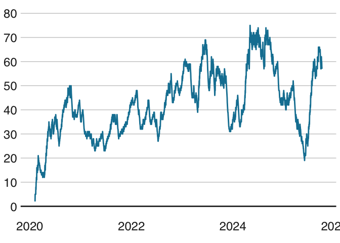

Training Load
================
Dominik Rappaport
2025-08-03

# Trainingsstatistiken

Übersicht über Trainingsstunden, TSS und CTL für die Jahre 2020 bis
2025. Als Zeitraum zum Berechnen des Durchschnitts wurden alle (bereits
verstrichenen) Wochen des Jahres herangezogen und nicht nur die, an
denen ein Training grundsätzlich möglich war. D. h., Urlaube,
Krankenstände, Dienstreisen usw. drücken den Schnitt.

| Jahr | Trainingsstunden | Trainingsstunden pro Woche (Ø) | TSS | TSS pro Woche (Ø) | CTL (Ø) |
|:---|---:|---:|---:|---:|---:|
| 2020 | 221 | 4.23 | 11781 | 225 | 31 |
| 2021 | 274 | 5.26 | 11660 | 224 | 31 |
| 2022 | 364 | 6.97 | 15427 | 296 | 41 |
| 2023 | 323 | 6.20 | 18271 | 350 | 52 |
| 2024 | 370 | 7.08 | 21071 | 403 | 56 |
| 2025 | 157 | 5.08 | 8590 | 278 | 38 |

Trainingsstatistik

<!-- -->
