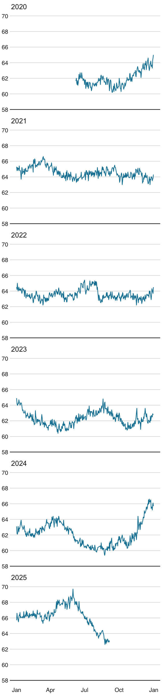
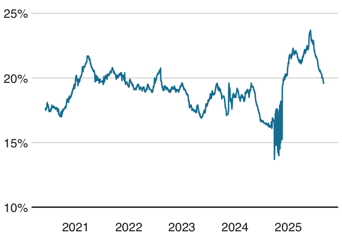
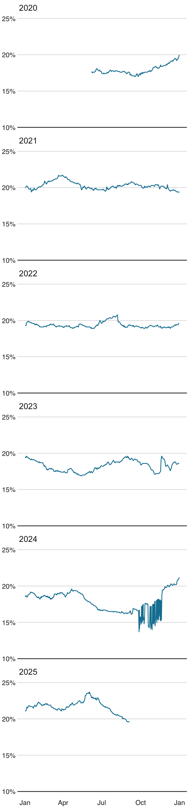
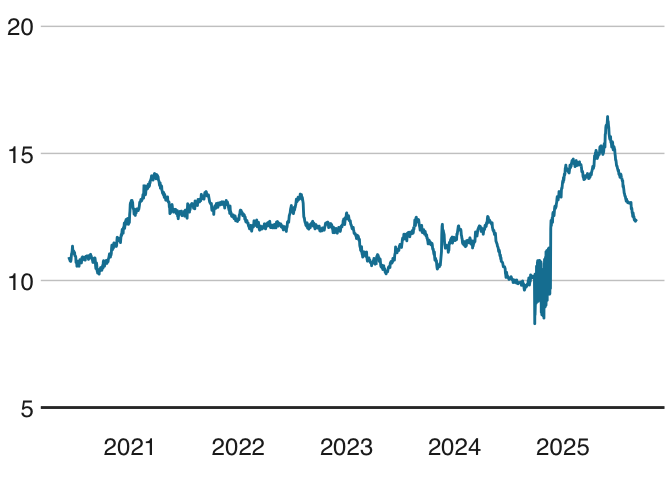
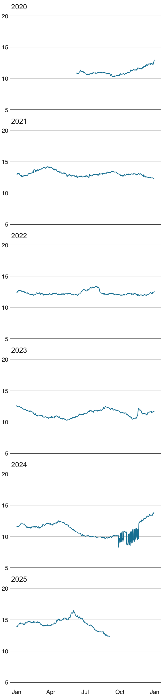

Gewicht
================

- [Gewichtsverlauf](#gewichtsverlauf)
  - [Verlauf gesamt](#verlauf-gesamt)
  - [Verlauf nach Jahren](#verlauf-nach-jahren)
- [Körperfettanteil](#körperfettanteil)
  - [Verlauf gesamt](#verlauf-gesamt-1)
  - [Verlauf nach Jahren](#verlauf-nach-jahren-1)
- [Körperfettverlauf absolut](#körperfettverlauf-absolut)
  - [Verlauf gesamt](#verlauf-gesamt-2)
  - [Verlauf nach Jahren](#verlauf-nach-jahren-2)

## Gewichtsverlauf

### Verlauf gesamt

<!-- -->

### Verlauf nach Jahren

<!-- -->

## Körperfettanteil

### Verlauf gesamt

<!-- -->

### Verlauf nach Jahren

<!-- -->

## Körperfettverlauf absolut

### Verlauf gesamt

<!-- -->

### Verlauf nach Jahren

<!-- -->
